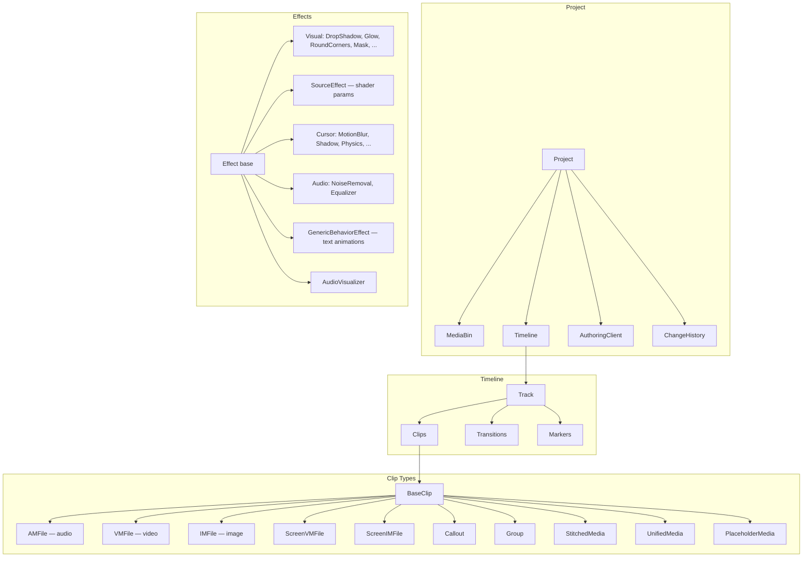

# pycamtasia — Architecture

## Overview

pycamtasia is a Python library for reading, writing, and manipulating TechSmith Camtasia project files (`.cmproj`/`.tscproj`). It wraps the underlying JSON format with typed Python classes, enabling programmatic video assembly, batch processing, and export without the Camtasia GUI. The primary use case is assembling demo videos from voiceover audio, diagram images, screen recordings, and title cards via scripts.

The library is structured as thin wrappers over JSON dicts — every class holds a reference to its slice of the project JSON, and mutations go directly to the dict. There is no separate model/serialization layer; `project.save()` writes the current state. This design keeps the library lightweight and ensures round-trip fidelity with Camtasia's format.

pycamtasia exposes two API layers: **L2 (high-level)** with methods like `clip.fade()`, `track.add_lower_third()`, and `proj.import_media()`; and **L1 (low-level)** via `clip._data` dict access as an escape hatch. Consumer code should always use L2 — if L2 doesn't expose something, add it to the library first.

## Architecture Diagram



## Package / Module Tree

### Root (`src/camtasia/`)

| Module | Description |
|---|---|
| `__init__.py` | Public API surface — re-exports all major classes and functions |
| `project.py` | `Project` class: load/save `.cmproj` bundles, import media, validation, cross-track grouping |
| `timing.py` | `EDIT_RATE` (705,600,000 ticks/sec), tick↔second conversion, `Fraction`-based scalar arithmetic |
| `color.py` | `RGBA` class (0–255 channels), `hex_rgb()` parser |
| `types.py` | Enums (`ClipType`, `EffectName`, `TransitionType`, `BlendMode`, `MaskShape`, …) and TypedDicts |
| `validation.py` | `validate_all()`: duplicate IDs, track indices, transition refs, src refs, schema validation |
| `authoring_client.py` | `AuthoringClient` dataclass — export/authoring metadata (name, platform, version) |
| `history.py` | `ChangeHistory` / `ChangeRecord` — undo/redo via JSON Patch diffs; `with_undo` decorator |
| `screenplay.py` | Markdown screenplay parser → `Screenplay` / `ScreenplaySection` / `VOBlock` / `PauseMarker` |
| `themes.py` | `Theme` / `ThemeManager` / `apply_theme()` — semantic color slots, theme import/export |
| `canvas_presets.py` | `VerticalPreset` enum (9:16, 4:5, 1:1, 16:9), `SafeZone` per platform |
| `frame_stamp.py` | `FrameStamp` — frame-number + frame-rate timestamp arithmetic |
| `extras.py` | `media_markers()` — iterate all media markers across tracks |
| `cli.py` | `pytsc` CLI entry point (via `docopt-subcommands`) |
| `app_validation.py` | Integration test harness — launch Camtasia, check for exceptions |
| `operations.py` | Legacy high-level operations module (`add_media_to_track`, etc.) |
| `version.py` | `__version__` string |

### `effects/`

| Module | Description |
|---|---|
| `__init__.py` | Re-exports all effect classes |
| `base.py` | `Effect` base class, `effect_from_dict()` factory, `register_effect()` decorator |
| `visual.py` | `DropShadow`, `Glow`, `RoundCorners`, `Mask`, `ColorAdjustment`, `Spotlight`, `LutEffect`, `Emphasize`, `MediaMatte`, `BlendModeEffect`, `CornerPin`, `ChromaKey`, `BackgroundRemoval` |
| `source.py` | `SourceEffect` — shader parameter effects (gradients, colors) |
| `cursor.py` | `CursorMotionBlur`, `CursorShadow`, `CursorPhysics`, `LeftClickScaling`, `CursorHighlight`, `CursorGlow`, `CursorMagnify`, `CursorLens`, `CursorColor`, `CursorNegative`, `CursorIsolation`, `CursorGradient`, `CursorPathCreator` |
| `audio.py` | `NoiseRemoval` (DFN3 VST), `Equalizer` |
| `behaviors.py` | `GenericBehaviorEffect` / `BehaviorPhase` — text animation in/center/out phases |
| `audio_visualizer.py` | `AudioVisualizer` — waveform overlay effect (unverified fixture) |

### `timeline/`

| Module | Description |
|---|---|
| `__init__.py` | Re-exports `Timeline`, `Track`, clip types, `Marker`, `Transition`, etc. |
| `timeline.py` | `Timeline` class, `group_clips_across_tracks()`, ID remapping |
| `track.py` | `Track`: add/remove clips, split, reorder, transitions, join, gap operations |
| `markers.py` | `MarkerList` — iterable marker collection on timeline or media |
| `marker.py` | `Marker` dataclass (name, time) |
| `transitions.py` | `Transition` / `TransitionList` — add supports rightMedia-only; validates clip IDs |
| `captions.py` | `DynamicCaptionStyle` — caption styling presets and configuration |

### `timeline/clips/`

| Module | Description |
|---|---|
| `__init__.py` | Re-exports all clip classes and `clip_from_dict()` factory |
| `base.py` | `BaseClip`: id, start, duration, scalar, effects, fade, mute/unmute, gain, opacity |
| `audio.py` | `AMFile` — audio clip |
| `video.py` | `VMFile` — video clip |
| `image.py` | `IMFile` — image clip |
| `screen_recording.py` | `ScreenVMFile`, `ScreenIMFile` — screen recording clips with cursor data |
| `callout.py` | `Callout` / `CalloutBuilder` — text overlay annotations |
| `group.py` | `Group` / `GroupTrack` — compound clips with internal tracks |
| `stitched.py` | `StitchedMedia` — joined adjacent clips |
| `unified.py` | `UnifiedMedia` — combined audio+video container; effect ops delegate to inner clip |
| `placeholder.py` | `PlaceholderMedia` — placeholder for missing or to-be-added media |

### `annotations/`

| Module | Description |
|---|---|
| `__init__.py` | Package init |
| `callouts.py` | Callout definition builders (text, shapes) |
| `shapes.py` | `rectangle()`, `ellipse()`, `triangle()` — shape annotation dict constructors |
| `types.py` | `Color`, `FillStyle`, `StrokeStyle` — annotation primitives |

### `audiate/`

| Module | Description |
|---|---|
| `__init__.py` | Re-exports `AudiateProject`, `Transcript`, `Word` |
| `project.py` | `AudiateProject` — loads `.audiate` files |
| `transcript.py` | Word-level transcript with timestamps (`Word(text, start, end)`) |

### `builders/`

| Module | Description |
|---|---|
| `__init__.py` | Re-exports all builder classes and functions |
| `timeline_builder.py` | `TimelineBuilder` — fluent API for timeline construction (add_background_image/video, etc.) |
| `screenplay_builder.py` | `build_from_screenplay()` — screenplay-driven assembly with interleaved pauses |
| `device_frame.py` | `add_device_frame()` / `remove_device_frame()` — wrap clips with phone/laptop bezels |
| `device_frame_library.py` | `DeviceFrameAsset` / `get_device_frame_asset()` — stub catalog for TechSmith frames |
| `dynamic_background.py` | `add_dynamic_background()` / `add_lottie_background()` — gradient/shader backgrounds |
| `slide_import.py` | `import_slide_images()` / `import_powerpoint()` — batch-import slides onto timeline |
| `tile_layout.py` | `TileLayout` — grid-based image arrangement on the timeline |
| `video_production.py` | Fluent builder for multi-section video productions (voiceover + images + recordings) |

### `export/`

| Module | Description |
|---|---|
| `__init__.py` | Re-exports `export_edl`, `export_csv`, `export_markers_as_srt`, etc. |
| `edl.py` | EDL (Edit Decision List) export — recurses into compound clips |
| `srt.py` | SRT subtitle export from timeline markers |
| `csv_export.py` | CSV export of timeline clip data (track, clip, timing, effects) |
| `report.py` | Project report generation (markdown/JSON) — recurses into compound clips |
| `timeline_json.py` | Timeline JSON export (simplified structure) |
| `audio.py` | Audio timeline metadata export as CSV/JSON for external mixing tools |
| `campackage.py` | `.campackage` ZIP archive export (pycamtasia interchange format, not native) |
| `captions.py` | Caption extract/reimport for translation workflows (`CaptionEntry`) |
| `chapters.py` | Chapter export from markers (WebVTT, MP4, YouTube formats) |
| `toc.py` | Table-of-contents export from markers (SmartPlayer XML, JSON) |

### `library/`

| Module | Description |
|---|---|
| `__init__.py` | Re-exports `Library`, `Libraries`, `LibraryAsset`, `export_libzip`, `import_libzip` |
| `library.py` | `Library` / `Libraries` / `LibraryAsset` — reusable asset management with folders |
| `libzip.py` | `.libzip` portable archive format (pycamtasia-defined, not native TechSmith) |

### `media_bin/`

| Module | Description |
|---|---|
| `__init__.py` | Re-exports `MediaBin`, `Media`, `MediaType` |
| `media_bin.py` | `MediaBin` / `Media` — source file management, `next_id()` collision avoidance |
| `trec_probe.py` | `.trec` file metadata extraction via pymediainfo |

### `operations/`

| Module | Description |
|---|---|
| `__init__.py` | Re-exports all operation functions |
| `speed.py` | `rescale_project()`, `set_audio_speed()`, `set_internal_segment_speeds()` |
| `sync.py` | Audio-video sync from transcript + markers (`plan_sync`, `match_marker_to_transcript`) |
| `merge.py` | `merge_projects()` — merge tracks/media from one project into another with ID remapping |
| `layout.py` | `pack_track()`, `ripple_insert()`, `ripple_delete()`, `snap_to_grid()`, `insert_gap()`, `remove_gap()` |
| `batch.py` | `apply_to_clips()`, `fade_all()`, `move_all()`, `scale_all()`, `set_opacity_all()` |
| `cleanup.py` | `compact_project()`, `remove_empty_tracks()`, `remove_orphaned_media()` |
| `diff.py` | `diff_projects()` → `ProjectDiff` — compare two projects structurally |
| `template.py` | `clone_project_structure()` — template-based project creation |
| `captions.py` | `generate_captions_from_audio()`, `sync_script_to_captions()`, `trim_silences()` (stubs) |
| `recording_sync.py` | Synchronize screen recording speed to voiceover timing |
| `slide_markers.py` | `mark_slides_from_presentation()` — create timeline markers from slide data |
| `stitch.py` | `auto_stitch_on_track()` — rejoin adjacent same-source clips after splitting |

### `templates/`

| Module | Description |
|---|---|
| `__init__.py` | Package init |
| `lower_third.py` | Right Angle Lower Third JSON template (pre-flattened for Camtasia compatibility) |
| `behavior_presets.py` | Behavior animation preset templates (reveal, sliding, fade, fly-in, etc.) |

## Key Data Flow

```
.cmproj bundle (directory on disk)
  └── project.tscproj (JSON file)

        ↓  load_project(path)

      Project
        ├── _data: dict          ← the entire JSON, held by reference
        ├── media_bin             ← MediaBin wrapping _data['sourceBin']
        ├── timeline              ← Timeline wrapping _data['timeline']
        │     └── tracks[]        ← Track wrapping each track dict
        │           ├── clips[]   ← BaseClip subclasses wrapping media dicts
        │           ├── transitions[]
        │           └── markers[]
        └── authoring_client      ← AuthoringClient from _data['authoringClientInfo']

        ↓  mutate via L2 API (all writes go to _data dicts)

        ↓  project.save()

      project.tscproj (JSON written back with Camtasia-compatible formatting)
```

Undo/redo is supported via `project.track_changes(description)` context manager, which records JSON Patch diffs before/after. After `undo()`/`redo()`, previously-obtained references to nested objects become stale — always re-access `project.timeline`, etc.

## Key Design Decisions

1. **Thin wrappers over JSON dicts** — no ORM, no separate model layer. Mutations go directly to `_data`. This ensures round-trip fidelity and keeps the codebase small.

2. **Rational scalars via `fractions.Fraction`** — Camtasia stores speed as `scalar = 1/speed`. All arithmetic uses `Fraction` to avoid floating-point drift. `speed_to_scalar()` / `scalar_to_speed()` handle conversion.

3. **Edit rate of 705,600,000 ticks/sec** — chosen by TechSmith to be evenly divisible by common frame rates (30, 60 fps) and audio sample rates (44100, 48000 Hz).

4. **Type-dispatched clip factory** — `clip_from_dict()` inspects the `_type` field and returns the correct `BaseClip` subclass. Similarly, `effect_from_dict()` uses a registry populated by `@register_effect`.

5. **Cascade-delete transitions on clip removal** — `track.remove_clip()` automatically removes transitions referencing the deleted clip. Direct `_data` mutation would leave dangling references that crash Camtasia.

6. **Hyphenated parameter keys** — Camtasia's JSON uses `mask-shape`, not `mask_shape`. Python properties map underscores to hyphens, but raw dict construction must use hyphens.

7. **JSON Patch undo/redo** — `ChangeHistory` stores minimal diffs (not full snapshots), making history memory-efficient even for large projects.

8. **Reverse-engineered format** — there is no official spec. All format knowledge comes from diffing Camtasia GUI output. New features must be validated by opening the result in Camtasia.

## Extension Points

### Adding a new Effect class

1. Create a class inheriting from `Effect` in the appropriate module (`effects/visual.py`, `effects/audio.py`, etc.)
2. Decorate with `@register_effect('EffectName')` — this registers it in the dispatch table used by `effect_from_dict()`
3. Add typed properties for the effect's parameters (using the plain scalar format: `{"defaultValue": ..., "type": ..., "interp": ...}`)
4. Add the effect name to `EffectName` enum in `types.py`
5. Export from `effects/__init__.py` and `camtasia/__init__.py`
6. Write tests in the corresponding test file

### Adding a new Clip type

1. Create a class inheriting from `BaseClip` in `timeline/clips/`
2. Register the `_type` string in the `clip_from_dict()` dispatch table in `timeline/clips/__init__.py`
3. Add the type to `ClipType` enum in `types.py`
4. Add type-specific properties and any special serialization logic
5. Export from `timeline/__init__.py` and `camtasia/__init__.py`

### Adding a new export format

1. Create a module in `export/` (e.g., `export/my_format.py`)
2. Implement an `export_my_format(project, output_path, **options)` function
3. Export from `export/__init__.py` and `camtasia/__init__.py`
4. Existing exporters (`edl.py`, `csv_export.py`, `report.py`) recurse into compound clips — follow the same pattern for nested content

## Testing Architecture

### Where tests live

All tests are in the flat `tests/` directory. Test files mirror source modules: `src/camtasia/timeline/track.py` → `tests/test_track.py`, `src/camtasia/operations/speed.py` → `tests/test_speed.py`.

### Fixtures

- **`project` fixture** (`conftest.py`): copies `src/camtasia/resources/new.cmproj` into `tmp_path` and loads it. Every test gets an isolated copy — no shared mutable state.
- **`test_project_a_data`**: loads `tests/fixtures/test_project_a.tscproj` (2.7MB real-world project) as a raw dict.
- **Test fixture files**: `tests/fixtures/` contains `.tscproj` files of varying complexity and `.wav` audio files.
- **Template project**: `src/camtasia/resources/new.cmproj` (~12KB) must stay clean; its `media/` directory is gitignored.

### Parallel execution

Tests run in parallel via `pytest-xdist` (`-n auto` configured in `pyproject.toml`). All tests are parallel-safe through isolated `tmp_path` copies. Serial execution (`-n0`) is used for coverage collection and debugging.

```bash
# Default parallel run (integration tests excluded)
PYTHONPATH=src python3 -m pytest tests/ -q

# With coverage (serial for accuracy)
PYTHONPATH=src python3 -m pytest tests/ -n0 --cov=camtasia --cov-report=term-missing
```

Key config: `timeout = 10` per test, `fail_under = 96` coverage, `tmp_path_retention_policy = "none"`.
